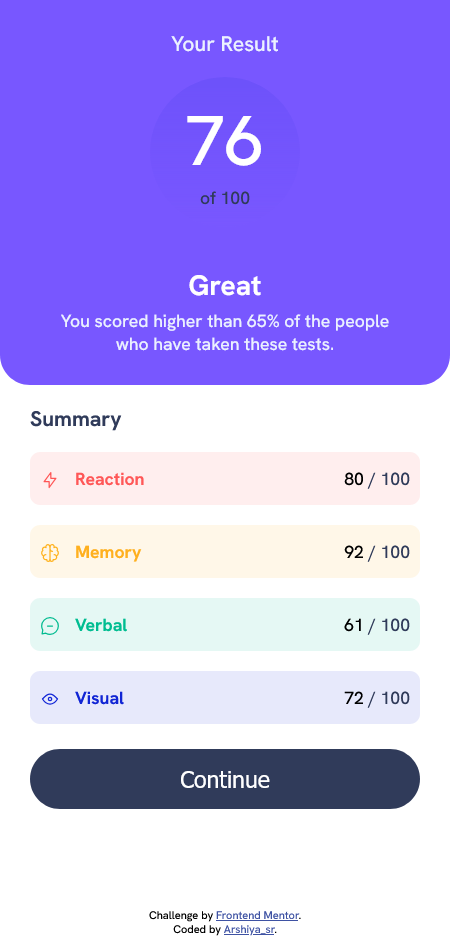

# Frontend Mentor - Results summary component solution

This is a solution to the [Results summary component challenge on Frontend Mentor](https://www.frontendmentor.io/challenges/results-summary-component-CE_K6s0maV). Frontend Mentor challenges help you improve your coding skills by building realistic projects. 

## Table of contents

- [Overview](#overview)
  - [The challenge](#the-challenge)
  - [Screenshot](#screenshot)
  - [Links](#links)
- [My process](#my-process)
  - [Built with](#built-with)
  - [What I learned](#what-i-learned)
  - [Continued development](#continued-development)
  - [Useful resources](#useful-resources)
  - [AI Collaboration](#ai-collaboration)
- [Author](#author)
- [Acknowledgments](#acknowledgments)

## Overview

### The challenge

Users should be able to:

- View the optimal layout for the interface depending on their device's screen size
- See hover and focus states for all interactive elements on the page
- **Bonus**: Use the local JSON data to dynamically populate the content

### Screenshot

preview desktop: .png)

preview mobile: 

### Links

- Solution URL: [solution URL](https://github.com/arshiya-sr/frontend-mentor-Results-summary-component-Project)
- Live Site URL: [live site URL](https://arshiya-sr.github.io/frontend-mentor-Results-summary-component-Project/)

## My process

### Built with

- Semantic HTML5 markup
- CSS custom properties
- Flexbox
- Mobile-first workflow
- media queries
- deepseek AI
- Github copilot AI

### What I learned

This project was simple, so I didn't learn anything special from it, but I still managed to improve my skills thanks to it. With enough repetition and practice, maybe I'll be able to do important tasks correctly and without bugs.

### Continued development

After publishing the project on Frontend Mentor, I might work on making the colors and sizing more precise.

### Useful resources

- [Deepseek AI](https://www.deepseek.com) - DeepSeek has helped me immensely on my learning journey—it's far better to use it for truly understanding concepts than for just getting answers and bypassing the work. And it helped me a lot more on this project.
- [github copilot AI](https://github.com/copilot) - GitHub Copilot has also been a huge help, especially when it comes to coding.
- [freecodecamp free online course](https://www.freecodecamp.org) - I gained my web development knowledge through freeCodeCamp, which is completely free and packed with resources: theory, labs, workshops, quizzes, and even review projects that help you master each topic. This project itself comes from freeCodeCamp, so a big thank-you to them.

### AI Collaboration

- What tools did you use (e.g., ChatGPT, Claude, GitHub Copilot)? i only used deepseek and github copilot AI a lot.
- How did you use them (e.g., debugging, generating boilerplate, brainstorming solutions)? i used it to help me understand the structure and debug small pieces of codes. also github copilot helped me nearly in all of it. It's really good.

## Author

- github - [my github](https://github.com/arshiya-sr)
- Frontend Mentor - [my frontend mentor](https://www.frontendmentor.io/profile/arshiya-sr)
- FreeCodeCamp - [my freecodecamp](https://www.freecodecamp.org/arshiya_sr)

## Acknowledgments

thank to Freecodecamp for this awesome Project/Challenge, and thank to you for paying your time and attention to my project. I'd be so happy to receive your advice and recommendations.
Hope you a good day ♥